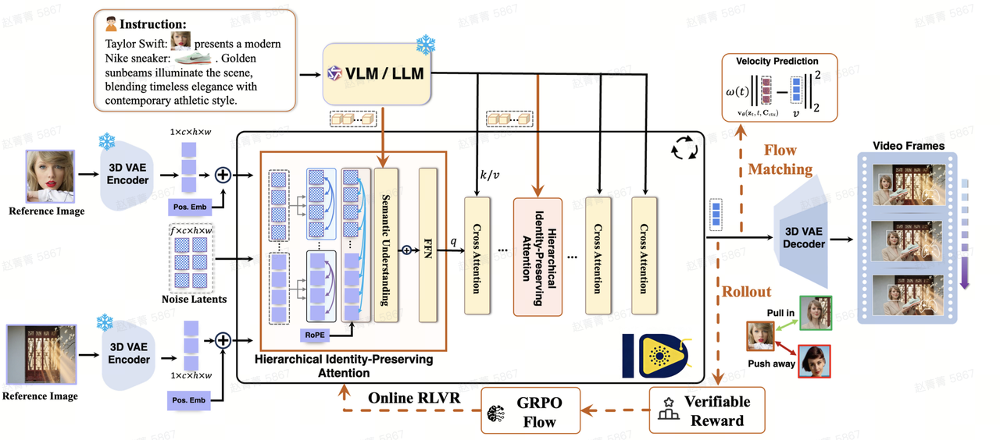

# ID-Crafter: VLM-Grounded Online RL for Compositional Multi-Subject Video Generation

[](https://arxiv.org/abs/2511.00511)
[](https://angericky.github.io/ID-Composer/)
[](./LICENSE)

Official repository for **ID-Crafter**, a framework for compositional multi-subject video generation from a text prompt and multiple reference images.


## 🎨ID-Crafter

We showcase compositional video generation results with multiple subjects, preserving identity consistency and enabling complex interactions.

<video 
  width="800" 
  controls 
  crossorigin="anonymous"
  preload="metadata"   
  poster="https://github.com/Angericky/ID-Composer/raw/main/assets/teaser.svg"  
>
  <!-- 核心：确认这个 Pages 链接能在浏览器直接打开（非 404） -->
  <source 
    src="assets/IDCrafter_website_teaser_compressed.mp4" 
    type="video/mp4; codecs=avc1" 
  >
  <!-- 错误兜底：加载失败时显示下载链接 -->
  视频加载失败，请手动下载：<a href="assets/IDCrafter_website_teaser_compressed.mp4">IDCrafter_website_teaser_compressed.mp4</a>
</video>

Visit our project page[https://angericky.github.io/ID-Composer/](https://angericky.github.io/ID-Composer/) for more interesting results!

## News

- `2025-11-01`: ID-Crafter was released on arXiv.
- `2025-12-15`: The paper was updated to `arXiv v4`.
- `2026`: The arXiv journal reference lists **CVPR 2026**.
- `2026-03-18`: The public repository scaffold was expanded with project documentation, citation metadata, prompt examples, and release notes.

## 🏗️ Architecture

<div align="center">
  
</div>

Our framework builds upon a compositional generation paradigm that integrates:

- **Identity Encoding** from multiple reference images  
- **Hierarchical Attention Mechanism** for identity preservation  
- **VLM-Guided Semantic Alignment** for interaction reasoning  
- **Online RL Optimization** for improved temporal consistency and realism  

This design enables scalable and controllable multi-subject video synthesis.

<!-- ## Current Status

This repository is being prepared for a broader public release. As of `2026-03-18`, the public `main` branch contains project-level documentation and release scaffolding, but it does **not** yet include the training pipeline, inference code, evaluation scripts, or model checkpoints.

For the detailed release note, see [docs/release_status.md](docs/release_status.md). -->
<!-- ## ✨ Highlights

- **Compositional Multi-Subject Video Generation**  
  Generate videos from a text prompt with multiple reference identities.

- **Hierarchical Identity-Preserving Attention**  
  Maintains identity consistency across frames and subjects.

- **VLM-Guided Semantic Reasoning**  
  Enables fine-grained interaction understanding between subjects.

- **Online Reinforcement Learning Refinement**  
  Improves temporal coherence and visual quality during generation.
 -->

## 📊 Performance


We evaluate ID-Crafter on the open-domain subject-to-video benchmark, comparing with both proprietary and open-source models.


### 📈 Quantitative Comparison

| Method | Total Score ↑ | Motion ↑ | FaceSim ↑ | Natural ↑ |
|--------|-------------|----------|-----------|-----------|
| VACE-14B | 52.87 | 15.02 | 55.09 | 72.78 |
| Phantom-14B | 52.32 | 33.42 | 51.48 | 68.66 |
| SkyReels-A2-P14B | 49.61 | 25.60 | 45.95 | 67.22 |
| **ID-Crafter (1.3B + RL)** | **55.16** | 36.50 | **66.10** | 69.15 |
| **ID-Crafter (14B)** | **57.05** | **40.34** | **60.71** | **73.23** |

ID-Crafter achieves state-of-the-art performance among open-source methods, improving total score by over  **4%** while significantly enhancing identity preservation (FaceSim), and further benefits from online RL to boost **motion alignment and visual quality**, with the 14B model delivering the best overall balance across all metrics.

## Release Roadmap

- [x] Paper and project page
- [x] Repository metadata and documentation scaffold
- [x] Machine-readable citation file
- [x] Prompt examples extracted from public demos
- [ ] Inference code
- [ ] Training code
- [ ] Evaluation scripts
- [ ] Benchmark/data release instructions
- [ ] Checkpoint download instructions

## Repository Layout

```text
.
├── assets/
│   ├── README.md
│   └── teaser.svg
├── configs/
│   ├── README.md
│   ├── eval.yaml
│   ├── inference.yaml
│   └── train.yaml
├── docs/
│   └── release_status.md
├── examples/
│   └── prompts.md
├── scripts/
│   ├── README.md
│   ├── evaluate.sh
│   ├── run_inference.sh
│   └── train.sh
├── .gitignore
├── CITATION.cff
├── CONTRIBUTING.md
├── LICENSE
├── README.md
└── requirements.txt
```

## Project Links

- Paper: <https://arxiv.org/abs/2511.00511>
- Project page: <https://angericky.github.io/ID-Composer/>
- Repository: <https://github.com/paulpanwang/ID-Crafter>

## Prompt Examples

We collected a few lightweight prompt summaries from the public project page in [examples/prompts.md](examples/prompts.md). They can be used later for demos, regression tests, or README examples once the generation code is released.

## Contributing

Contribution guidance is available in [CONTRIBUTING.md](CONTRIBUTING.md). The current public branch is still scaffold-first, so documentation and repository-structure improvements are the safest contributions right now.

## Citation

If you find ID-Crafter useful in your research, please cite:

```bibtex
@misc{pan2025idcraftervlmgroundedonlinerl,
  title={ID-Crafter: VLM-Grounded Online RL for Compositional Multi-Subject Video Generation},
  author={Panwang Pan and Jingjing Zhao and Yuchen Lin and Chenguo Lin and Chenxin Li and Hengyu Liu and Tingting Shen and Yadong MU},
  year={2025},
  eprint={2511.00511},
  archivePrefix={arXiv},
  primaryClass={cs.CV},
  url={https://arxiv.org/abs/2511.00511}
}
```

## License

This repository is distributed under the included [ID-Composer Non-Commercial License v1.0](LICENSE).
