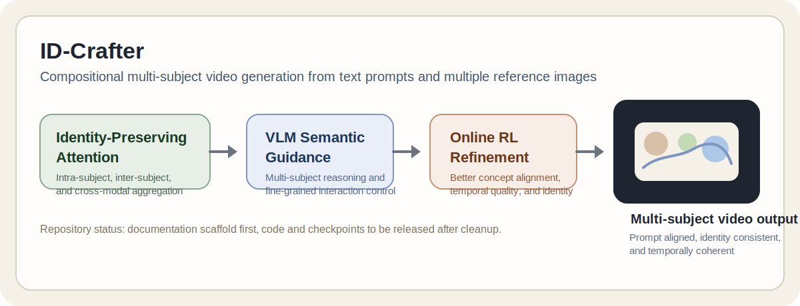

# ID-Crafter: VLM-Grounded Online RL for Compositional Multi-Subject Video Generation

[](https://arxiv.org/abs/2511.00511)
[](https://angericky.github.io/ID-Composer/)
[](./LICENSE)

Official repository for **ID-Crafter**, a framework for compositional multi-subject video generation from a text prompt and multiple reference images.



## News

- `2025-11-01`: ID-Crafter was released on arXiv.
- `2025-12-15`: The paper was updated to `arXiv v4`.
- `2026`: The arXiv journal reference lists **CVPR 2026**.
- `2026-03-18`: The public repository scaffold was expanded with project documentation, citation metadata, prompt examples, and release notes.

## Overview

ID-Crafter targets a difficult setting in video generation: producing a coherent video that preserves the identities of multiple subjects while still following a compositional text prompt. The method combines:

- **Hierarchical identity-preserving attention** to aggregate information within subjects, across subjects, and across modalities.
- **VLM-guided semantic reasoning** to capture fine-grained interactions among multiple subjects.
- **Online reinforcement learning refinement** to improve concept alignment, identity preservation, and temporal quality.

According to the paper, ID-Crafter establishes strong performance on multi-subject video generation benchmarks and introduces a new dataset for training and evaluation.

## Current Status

This repository is being prepared for a broader public release. As of `2026-03-18`, the public `main` branch contains project-level documentation and release scaffolding, but it does **not** yet include the training pipeline, inference code, evaluation scripts, or model checkpoints.

For the detailed release note, see [docs/release_status.md](docs/release_status.md).

## Release Roadmap

- [x] Paper and project page
- [x] Repository metadata and documentation scaffold
- [x] Machine-readable citation file
- [x] Prompt examples extracted from public demos
- [ ] Inference code
- [ ] Training code
- [ ] Evaluation scripts
- [ ] Benchmark/data release instructions
- [ ] Checkpoint download instructions

## Repository Layout

```text
.
├── assets/
│   ├── README.md
│   └── teaser.svg
├── configs/
│   ├── README.md
│   ├── eval.yaml
│   ├── inference.yaml
│   └── train.yaml
├── docs/
│   └── release_status.md
├── examples/
│   └── prompts.md
├── scripts/
│   ├── README.md
│   ├── evaluate.sh
│   ├── run_inference.sh
│   └── train.sh
├── .gitignore
├── CITATION.cff
├── CONTRIBUTING.md
├── LICENSE
├── README.md
└── requirements.txt
```

## Project Links

- Paper: <https://arxiv.org/abs/2511.00511>
- Project page: <https://angericky.github.io/ID-Composer/>
- Repository: <https://github.com/paulpanwang/ID-Crafter>

## Prompt Examples

We collected a few lightweight prompt summaries from the public project page in [examples/prompts.md](examples/prompts.md). They can be used later for demos, regression tests, or README examples once the generation code is released.

## Contributing

Contribution guidance is available in [CONTRIBUTING.md](CONTRIBUTING.md). The current public branch is still scaffold-first, so documentation and repository-structure improvements are the safest contributions right now.

## Citation

If you find ID-Crafter useful in your research, please cite:

```bibtex
@misc{pan2025idcraftervlmgroundedonlinerl,
  title={ID-Crafter: VLM-Grounded Online RL for Compositional Multi-Subject Video Generation},
  author={Panwang Pan and Jingjing Zhao and Yuchen Lin and Chenguo Lin and Chenxin Li and Hengyu Liu and Tingting Shen and Yadong MU},
  year={2025},
  eprint={2511.00511},
  archivePrefix={arXiv},
  primaryClass={cs.CV},
  url={https://arxiv.org/abs/2511.00511}
}
```

## License

This repository is distributed under the included [ID-Composer Non-Commercial License v1.0](LICENSE).
